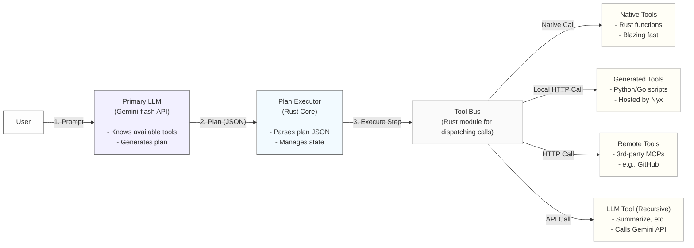

# Architecture

The architecture of Nyx Agent is designed around a central "Plan Executor" that interprets and runs command sequences generated by a primary LLM. It's a dynamic, tool-first model that prioritizes modularity, speed, and self-improvement.

## High-Level Diagram: The Plan Execution Flow


---

## Core Components

#### 1. Plan Executor (Rust Core)
This is the heart of the agent, living in `src-tauri/src/orchestrator.rs`. It is not the "brain." It is a dumb, reliable interpreter. Its sole job is to receive a plan (a JSON array of tool calls) from the Primary LLM and execute it step-by-step.
-   It parses the plan.
-   It manages the state, passing the output of step `N` as the input to step `N+1`.
-   It communicates with the Tool Bus to dispatch each tool call.
-   **Crucially, it handles errors.** If the Tool Bus returns a `ToolNotFound` error, it triggers the **Tool Genesis Protocol**.

#### 2. The Primary LLM (Conductor)
This is the remote Gemini-flash model. It's the true "brain" of the operation.
-   On every user request, it is sent the prompt along with a system message containing a list of all currently available tools from the Tool Bus registry.
-   Its only output is a structured JSON "plan". It does not execute anything itself.
-   It is also responsible for generating the code for new tools when the Tool Genesis Protocol is activated.

#### 3. The Tool Bus (Rust Core)
This is a registry and dispatcher. When the Plan Executor wants to run `tool:file_system.fuzzy_find`, it asks the Tool Bus. The Bus knows where to find that tool and how to call it. It categorizes tools into several types:

-   **Native Tools:** High-performance Rust functions compiled directly into the Nyx binary. These are for common, speed-critical operations like file I/O, fuzzy-finding, screen capture, and low-level system control.
    -   **Tech:** Rust functions exposed via an internal enum. `skim` crate for fuzzy-finding.

-   **Generated Tools:** These are the scripts (Python, Go, etc.) that the LLM generates on the fly. When a new tool is created, Nyx saves the script to the `tools/` directory and spins up a minimal, local web server (using `py-micro-http` or a Go equivalent) to host it as an MCP-compliant endpoint. The Tool Bus registers this new endpoint (e.g., `localhost:3001/file_system.move`).
    -   **Tech:** `std::process::Command` to run scripts/servers, `reqwest` to call them.

-   **Remote Tools:** Standard, third-party MCP servers that Nyx can connect to. For example, if the user installs a standard GitHub MCP server, Nyx can use it without needing to generate any tools.

-   **The LLM Tool (Recursive):** A special tool type that allows a plan to call back to the Primary LLM for a pure language task (e.g., `llm.summarize`, `llm.translate`). This prevents the LLM from having to stuff large blocks of text into a plan and allows for powerful, nested AI operations.

#### 4. The Tool Genesis Protocol
This is the agent's self-improvement loop, managed by the Plan Executor.
1.  **EXECUTE:** Executor tries to dispatch `tool:mattermost.post(...)`.
2.  **FAIL:** Tool Bus returns `Error::ToolNotFound("mattermost.post")`.
3.  **INTERRUPT:** Executor pauses plan execution.
4.  **GENERATE:** Executor calls the Primary LLM with a special prompt: "Generate the code for a tool with this signature: `mattermost.post(channel, message)`. Here are examples of existing tools for context..."
5.  **SAVE & HOST:** Executor saves the returned script to `tools/mattermost_post.py` and starts its local server.
6.  **REGISTER:** Executor tells the Tool Bus to register the new tool at its local endpoint.
7.  **RESUME:** Executor re-attempts the failed step from the plan, which now succeeds.

---

## Folder Structure

```bash
nyx-agent/
│
├── docs/
│   ├── About.md
│   ├── Architecture.md
│   └── Instruction.md
│
├── src/                      # Svelte Frontend UI
│   ├── components/
│   │   ├── CommandBar.svelte
│   │   └── ToolManager.svelte # UI for viewing/editing generated tools
│   └── ...
│
├── src-tauri/                # Rust Core
│   ├── Cargo.toml
│   └── src/
│       ├── main.rs           # App setup
│       ├── orchestrator.rs   # The Plan Executor & Tool Genesis logic
│       ├── tool_bus.rs       # Tool registry and dispatcher
│       └── native_tools/     # Module for built-in, high-performance Rust tools
│           ├── mod.rs
│           ├── file_system.rs
│           └── perception.rs
│
├── tools/                    # The agent's dynamic, self-generated toolbox
│   ├── .gitignore            # Ignore all scripts
│   └── (Nyx will create scripts here, e.g., mattermost_post.py)
│
├── ... (standard project files)
```